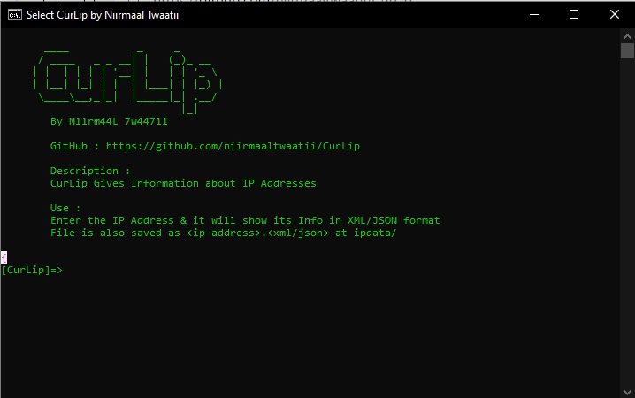

# CurLip
       ____           _     _
      / ____   _ _ __| |   (_)_ __
     | |  | | | | '__| |   | | '_ \
     | |__| |_| | |  | |___| | |_) |
      \____\__,_|_|  |_____|_| .__/
                             |_|
	By N11rm44L 7w44711

## SetUp & Installation
```
git clone https://github.com/niirmaaltwaatii/CurLip
cd CurLip
curlip | curlip.bat OR ./curlip.bat | ./curlip
```

## Description
CurLip Gives Information about IP Addresses using ip-api<br>
**API** : _https://www.ip-api.com/_

## Images


## How to Use ?
* Enter the IP Address & it will show its Info in XML/JSON format <br>
* File is also saved as _ip-address.xml/json_ at ipdata/
